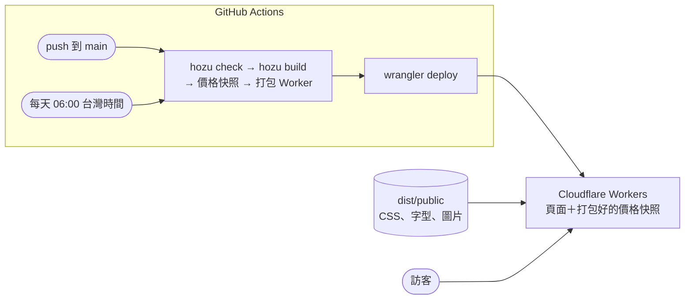

# 台灣當季蔬果

依「台灣時間的今天」顯示當季蔬菜、水果與**建議購買**品項，並附上農業部批發行情與挑選技巧。以 [Hozu](https://www.npmjs.com/package/create-hozu) 框架打造，部署在 **Cloudflare Workers**。除了「收藏」之外，所有功能**不需要 JavaScript** 即可運作。

## 功能

| 頁面 | 網址 | 說明 |
| ---- | ---- | ---- |
| 首頁 | `/` | 依台灣時間（Asia/Taipei）判斷當月：建議購買、當季蔬菜、當季水果 |
| 搜尋 | `/search?q=草莓` | 搜尋全部 77 種蔬果（不限當季），可用官方品名，例如「甘藍」找到高麗菜、「結球白菜」找到大白菜 |
| 品項頁 | `/produce/mango` | 單一蔬果：產季月曆（盛產／當季／本月）、批發價與 30 天走勢、主要產地、挑選技巧、也稱（官方品名）。卡片上的品名都可以點進來；找不到時回應 404 |
| 我的收藏 | `/favorites` | 收藏的蔬果（不限當季），存在瀏覽器的 localStorage |
| 找不到頁面 | 任何不存在的網址 | 中文 404 頁（狀態碼 404），附回首頁與搜尋的連結；本身位於 `/not-found`（`noindex`） |
| 範本首頁 | `/demo` | `create-hozu` 產生的範本，保留對照用 |
| 狀態 API | `/api/status` | JSON：價格來源、快照產生時間、最近交易日（供每日檢查使用） |

| 首頁功能 | 說明 | 網址參數 |
| -------- | ---- | -------- |
| 建議購買 | 正值盛產期，**或**批發價比近 30 天便宜 10% 以上。依「便宜幅度＋盛產 0.15 分」排序，**只顯示前 8 名**，其餘收在「看更多」（同分時蔬菜、水果交錯） | — |
| 品項照片 | 建議購買、搜尋、收藏卡片與品項頁顯示照片（75/77 項，來自 Wikimedia Commons 自由授權），品項頁標示作者與授權 | — |
| 價格走勢 | 每張卡片附近 30 天的每日批發均價走勢線（伺服器產生 SVG，下跌時為紫羅蘭色；沒有交易的日子直接連到前後交易日，不斷線），並有文字描述供螢幕閱讀器使用 | — |
| 切換月份 | 查看其他月份的產季（價格只提供本月） | `?month=1`–`12` |
| 篩選 | 全部／價格划算／盛產期，三個區塊同時套用 | `?show=all\|cheap\|peak` |

- 參數可以組合，例如 `/?month=1&show=peak`。超出範圍的值（例如 `?month=13`）會自動退回預設。
- **收藏**：每張卡片右上角的 ♡。只存在這台裝置的這個瀏覽器，多個分頁會同步；清除瀏覽資料、換裝置或無痕模式就不會保留。沒有 JavaScript 時不顯示收藏按鈕。
- **頁首**固定在最上方（各種螢幕寬度都維持一行），導覽以底線標示目前頁面。
- **區塊 tab**（篩選欄上方）：當月建議購買／當季蔬菜／當季水果，點擊平滑捲動到該區塊（錨點連結；開啟「減少動態效果」時直接跳轉）；往上捲時固定在頁首下方（`position: sticky`）。平常沒有底色，**固定住時才出現與篩選欄相同的米白底色，橫跨整個畫面寬度**：「是否固定住」由小型客戶端元件 `StickyTabs`（`IntersectionObserver`）判斷，底色由 `app.css` 的 `section-tabs` 繪製；沒有 JavaScript 時底色一律顯示。**捲動時自動以底線標示目前所在區塊的 tab**（`aria-current`，螢幕閱讀器也讀得到）。頁首與 tab 的高度直接取自 `--header-height`、`--tabs-height`，停靠位置 `--section-offset` 由兩者計算，改樣式不會讓位置跑掉。

## 快速開始

需要 **Node.js 22.18 以上**（專案附有 `.nvmrc`）。

```bash
nvm use          # 切換到 .nvmrc 指定的 Node 22
npm install
npm run dev      # 開發伺服器：http://127.0.0.1:3000
```

> 若 `localhost:3000` 開到別的程式，請改用 `127.0.0.1:3000`。

### 常用指令

| 指令 | 用途 |
| ---- | ---- |
| `npm run dev` | 開發伺服器（含 Hozu DevTools，可在頁面上選取元素提出修改） |
| `npm run check` | 型別與 Hozu 規則檢查，提交前請先跑過 |
| `npm test` | 核心規則與各頁面的測試（`tests/`，約 1 秒，不呼叫農業部 API） |
| `npm start` | 正式模式啟動（Node） |
| `npm run build` | 建置（Node） |
| `npm run sync:catalog` | 從農糧署開放資料更新 `data/afa-peak-season.json`（每週自動執行並開 PR） |
| `npm run sync:volume` | 抓過去 12 個完整月份的農業部交易量（`data/moa-monthly-volume.json`）；資料已是最新時不動作（每週自動執行，實際每月更新一次） |
| `npm run compare:peaks` | 比較交易量盛產月與目前的盛產月，輸出 `docs/phase-b-peak-comparison.md` |
| `npm run fonts` | 重新產生字型子集 `assets/fonts/*.woff2`（新增中文字後執行） |
| `npm run snapshot:prices` | 抓農業部行情、產生價格快照 `.cache/price-snapshot.json` |
| `npm run share-image` | 產生首頁分享圖卡 `assets/share.jpg`（需要 Chrome；先有價格快照會更準） |
| `npm run build:worker` | 字型子集＋價格快照＋分享圖卡＋建置＋打包 Cloudflare Worker（`dist/worker/`） |
| `npm run preview:worker` | 在本機用 Cloudflare 執行環境（workerd）預覽：http://127.0.0.1:8787 |
| `npm run deploy` | 手動部署到 Cloudflare（需先 `npx wrangler login`） |

`/demo` 保留了 `create-hozu` 產生的範本首頁，方便對照。

## 專案結構

```
data/
  afa-peak-season.json  農糧署開放資料整理結果（腳本產生，勿手改）
  moa-monthly-volume.json  各品項過去 12 個月的平均每日交易量（腳本產生，勿手改）
  photo-credits.json    品項照片的 Commons 檔名、作者、授權（腳本產生）
assets/photos/     品項照片，640×480 JPEG（腳本產生）
photos.css         每張照片一條 `[data-photo="…"]` 規則（腳本產生，app.css 匯入）
features/produce/
  crop-profiles.ts 人工資料：顯示名稱、挑選技巧、已驗證的盛產月、與官方品名的對照、官方沒有的品項
  catalog.ts       合併開放資料與人工資料，產生 77 種蔬果目錄
  volume-peaks.ts  由交易量算出盛產月（≥ 12 個月平均的 1.4 倍，補上單一缺口月份）
  market-names.ts  常見名稱 ↔ 農業部官方品名對照（高麗菜 = 甘藍）
  moa-client.ts    呼叫農業部 API、磁碟／記憶體快取
  market.ts        即時計算：各市場加權平均價、與近 30 天比較的漲跌、每日價格序列
  trend.ts         價格序列 → 走勢線 SVG 路徑與文字描述
  prices.ts        價格來源：部署快照，或即時計算（全目錄算一次、快取 1 小時）
  season.ts        組合當月清單、推薦與篩選
  catalog-cards.ts 共用的品項卡片資料（價格、產季文字、是否當季）
  search.ts        全目錄搜尋、收藏頁用的全目錄卡片
  detail.ts        品項頁資料：卡片＋12 個月產季月曆
  taipei-date.ts   台灣日期、民國年格式
  model.ts         Hozu 資料格式與 query 定義
  views.ts         首頁、搜尋頁、收藏頁畫面
  components.ts    客戶端元件：收藏按鈕 ♡、收藏清單、固定 tab 的底色判斷
  *.client.ts      上述元件在瀏覽器執行的程式
  favorites-store.ts  收藏的 localStorage 讀寫與同步
  photos.ts        哪些品項有照片、照片出處（讀 data/photo-credits.json）
  icons.ts         SVG 圖示（Lucide）
app.ts             伺服器端 resolvers
app.css            色彩、字型、背景
routes.ts          網址與參數
hozu.config.ts     頁面設定
worker/
  index.ts         Cloudflare Worker 入口（載入價格快照）
scripts/
  sync-catalog.ts     下載並整理農糧署「每月盛產農產品產地」
  sync-volume.ts      彙整農業部過去 12 個月的交易量
  compare-peaks.ts    產生交易量與盛產月的比對報告
  fetch-photos.ts     從 Wikimedia Commons 取得自由授權照片、裁切壓縮、產生 photos.css
  subset-fonts.ts     產生只含網站用字的 Noto TC 字型（見下方「字型」）
  make-share-image.ts 產生每日分享圖卡（headless Chrome＋sharp）
  check-price-freshness.ts  檢查線上價格是否過期（每日 workflow 使用）
  check-pages.ts      檢查線上重要頁面（每 3 小時 workflow 使用）
  price-snapshot.ts   產生價格快照（農業部失敗時寫入「無價格」快照，不擋部署）
  build-worker.ts     以 esbuild＋Hozu 外掛打包 Worker
tests/            node:test 測試：盛產規則、交易量盛產月、推薦與篩選、走勢線、各頁面（狀態碼、h1、404）
wrangler.jsonc     Cloudflare 設定
.github/workflows/check.yml         每個 PR 跑 `hozu check` 與測試
.github/workflows/deploy.yml        自動部署（部署前同樣先跑檢查與測試）
.github/workflows/sync-catalog.yml  每週同步開放資料與交易量，有變動就開 PR，並在 PR 留言回報檢查與測試結果
.github/workflows/price-watch.yml   每日檢查價格是否過期，過期就開 issue、恢復就關閉
.github/workflows/pages-watch.yml   每 3 小時檢查重要頁面（狀態碼、內容、回應時間），異常就開 issue、恢復就關閉
hozu.lock.json     Hozu 記錄的端點與轉換（`hozu check --update-lock` 更新）
```

## 資料來源與推薦邏輯

### 蔬果目錄（當季月份、產地）

| 來源 | 內容 | 維護方式 |
| ---- | ---- | -------- |
| 農糧署「[每月盛產農產品產地](https://data.gov.tw/dataset/8120)」 | 64 種蔬果的盛產月份、主要產地縣市 | `scripts/sync-catalog.ts` 每週同步，變動時開 PR 審核 |
| 農業部「農產品交易行情」交易量 | 各品項每月平均每日交易量（過去 12 個完整月份） | `scripts/sync-volume.ts` 每週檢查、每月更新，變動時開 PR 審核 |
| `crop-profiles.ts`（人工） | 顯示名稱、挑選技巧、已驗證的盛產月；官方未收錄的 13 種（茼蒿、蘆筍、南瓜、空心菜、地瓜葉、冬瓜、秋葵、嫩薑、蓮藕、芋頭、菱角、甜玉米、桑椹） | 手動 |

- **當季** = 官方盛產月份。**盛產（建議購買用）**：原有品項沿用已驗證的盛產月（與官方月份取交集）；新品項取「產地數達最多月份 75% 以上」的月份；仍然沒有盛產月的品項（例如全年供應的芭樂、木瓜），改用**交易量盛產月**：平均每日交易量 ≥ 12 個月平均 1.4 倍的月份；夾在兩個盛產月中間的單一月份也算（例如蘋果 8、9、11 → 8–11 月），最後只保留當季月份。交易量也找不到高峰時（香蕉、甜椒），就不設盛產月，只在價格划算時推薦。
- **為什麼交易量只用來補缺**：交易量反映的是市場供應量，不完全等於產季。洋蔥、芋頭、南瓜這類可冷藏的作物，收成後會陸續出貨，交易量高峰比產季晚；已有盛產月的品項因此維持不變。逐項比對見 `docs/phase-b-peak-comparison.md`。
- **官方資料的已知問題**：鳳梨主要產區（屏東、臺南）的資料列沒有月份，同步時被略過，所以鳳梨改以人工維護（`supersedes`）。
- 官方新增、但還沒寫 profile 的作物會自動出現在網站上，只是沒有挑選技巧。

### 價格

價格來自農業部「[農產品交易行情](https://data.moa.gov.tw/)」開放資料（免金鑰），為**批發價**，零售價約為其 1.5–2 倍。推薦條件：**盛產期，或批發價比近 30 天便宜 10% 以上**。

價格有兩種來源，由 `features/produce/prices.ts` 決定：

| 環境 | 價格來源 | 更新頻率 |
| ---- | -------- | -------- |
| 本機 `npm run dev`／`npm start` | 即時呼叫農業部（逐日抓 30 天，蔬菜 N04／水果 N05），全目錄算一次後快取 1 小時 | 每小時 |
| Cloudflare Workers | 部署時產生的**價格快照**，打包進 Worker；頁面**不會**呼叫農業部 | 每天部署一次 |

- **本機第一次啟動較慢**：沒有快取時要抓 30 天資料（約 20 秒，上限 25 秒；逾時就先不顯示價格）。3 天前的資料會永久存在 `.cache/moa/`，之後重啟只要重抓最近 3 天。
- **農業部 API 失敗時**：本機只依產季推薦；部署時則寫入「無價格」快照，網站顯示「暫時無法取得行情」，**不會擋住部署**。
- **部署時的時限**：產生快照最多等 5 分鐘（網頁請求只等 25 秒）。GitHub Actions 的機器在美國，第一次沒有快取時要跨太平洋抓約 60 次；之後 `.cache/moa` 會被 Actions 快取保留，只需補抓最近幾天。

## 部署（Cloudflare Workers）



- **頁面快取**：公開查詢使用 `freshness: { revalidate: 300 }`，頁面在伺服器端快取 5 分鐘（`x-hozu-cache` 標示命中與否；瀏覽器端 `max-age=0, must-revalidate`，不會看到過期頁面）。檔名帶雜湊的字型、圖片、CSS、元件 JS（`/_hozu/a/*`、`/_hozu/c/*`、`/_hozu/chunk-*`、`/_hozu/styles.*`）則由 `scripts/build-worker.ts` 寫入的 `_headers` 設為一年 `immutable`，回訪不必重新確認約 500 KB 的字型。價格只隨部署更新；午夜換日後最多 5 分鐘仍顯示前一天。實測重複請求：搜尋頁 17.6 → 1.8 ms。
- **免費方案即可**：價格事先算好，每次請求在 workerd 實測平均約 1.2 ms（免費方案上限 10 ms CPU）。
- **自動部署**：`.github/workflows/deploy.yml` 在 push 到 `main`、每天 06:00 與 09:00（台灣時間；09:00 為備援，GitHub 排程可能延遲或略過）與手動觸發時部署。
- **頁面監控**：`pages-watch.yml` 每 3 小時檢查首頁、搜尋、收藏、品項頁、`/api/status`、sitemap、robots 回應 200（不存在的品項回應 404）、首頁確實有「當月建議購買」、回應不超過 5 秒；異常時開 issue「網站頁面異常（自動偵測）」，恢復自動關閉。Cloudflare 端的錯誤（例如 1102 超出資源限制）可在後台 Workers → Metrics 查看；若要自動讀取，需替 API Token 加上 Account Analytics 讀取權限。
- **價格過期提醒**：`price-watch.yml` 每天 12:00 讀取 `/api/status`；快照超過 48 小時、沒有價格、或最近交易日超過 4 天時，自動開 issue「價格資料過期（自動偵測）」（已開則留言），恢復後自動關閉。需要在 GitHub repo 設定兩個 secrets：
  - `CLOUDFLARE_API_TOKEN`：Cloudflare 後台 → My Profile → API Tokens → 用「Edit Cloudflare Workers」範本建立
  - `CLOUDFLARE_ACCOUNT_ID`：Cloudflare 後台 Workers 頁面右側
- **手動部署**：`npx wrangler login` 後執行 `npm run deploy`。
- **為什麼打包要自己做**：Worker 需要以 Hozu 的 esbuild 外掛（`@hozu/transform/esbuild`）打包，它會替每個檔案填入自己的 `import.meta.url`（workerd 沒有），元件和樣式靠它找到建置產物。`worker/index.ts` 直接使用 `hozu build` 的 `dist/manifest.json`。
- **曾經的繞道做法（已移除）**：Hozu 0.17–0.20.1 以函式文字當作元件指紋，打包後 Worker 會因「建置紀錄不符」拒絕啟動，所以曾經自己校正雜湊、替換 `@hozu/bundle`。我們回報的 [olevatorr/Hozu#1](https://github.com/olevatorr/Hozu/issues/1) 已在 **0.20.2** 修正，這些程式碼已經刪除。

## 測試

- `npm test` 以 Node 內建的 `node:test` 執行（`--import @hozu/transform/register` 載入 Hozu 轉換，頁面測試用 `@hozu/testing` 的 `testApp`）。
- 價格一律用測試裡的固定快照，不呼叫農業部 API，所以結果穩定、約 1 秒跑完。
- 測試的是規則而不是資料數值（例如「盛產月一定在當季內」「人工盛產月優先於交易量」），每月更新的資料不會讓測試失效；規則被改壞時會失敗。
- 每週資料同步由 GitHub Actions 自己開 PR，這種 PR 不會觸發 `check.yml`，所以同步流程會自己跑檢查，並把結果留言在 PR 上。

## 品項照片

- 來源：每個品項 zh.wikipedia 條目的代表圖，只接受**自由授權**（CC0、CC BY、CC BY-SA、公有領域；GFDL／GPL 因需附全文而排除）。條目圖不合適（植株、手繪圖、無關照片）時，在 `scripts/fetch-photos.ts` 的 `PHOTO_OVERRIDES` 指定人工挑選的 Commons 檔案；`null` 代表不放照片（目前桂竹筍、茂谷柑：Commons 上找不到這兩個品種本身的照片，寧缺勿用相似品種）。
- 處理：裁成 640×480、壓縮（中位數約 40 KB，全部約 2.9 MB）。
- 顯示：以 CSS 背景圖呈現（`data-photo` 屬性對應 `photos.css`），所以 Node 與 Cloudflare 都由 Hozu 的 CSS 資產流程提供；只有實際顯示的卡片會下載照片（收起的「看更多」不下載）。
- 新增照片或調整：執行 `npm run photos`，再人工檢查。

## SEO

- 網站網址設為正式網址（`hozu.config.ts` 的 `site.url`），canonical 與 Open Graph 連結都由它產生。
- `/sitemap.xml` 由 Hozu 依品項頁的 `entries` 自動產生（首頁、搜尋頁＋77 個品項頁）；`/robots.txt` 排除 `noindex` 的收藏頁與範本頁。
- 每個品項頁有專屬標題與描述，例如「芒果｜產季、價格與挑選技巧」。
- **分享縮圖（Open Graph）**：首頁與搜尋頁使用每日圖卡 `assets/share.jpg`（1200×630：日期＋今日前 4 名建議購買的照片與降幅），由 `scripts/make-share-image.ts` 在每次部署時以 headless Chrome 依網站字型與布紋截圖產生；找不到 Chrome 或失敗時沿用已提交的圖卡，不擋部署。品項頁使用該品項的 Commons 照片（`Special:FilePath`，寬 1200），沒有照片時用每日圖卡。

## 字型

Noto Sans TC（內文）與 Noto Serif TC（標題）使用**子集字型**：`scripts/subset-fonts.ts` 從 Google Fonts 下載完整可變字型（快取於 `.cache/fonts/`），只保留原始碼中出現的字、英數字與常用標點，輸出 `assets/fonts/*.woff2`（合計約 470 KB，字重 400–700）。

- **為什麼**：Hozu 會預載入 CSS 裡每個本地字型檔；Fontsource 版本拆成約 200 個檔案，每次開頁要下載約 15 MB，並拖住客戶端腳本。
- **新增中文字後**：執行 `npm run fonts`（部署時會自動重新產生）。不在子集裡的字（例如使用者搜尋的罕見字）會改用系統字型顯示。

## 授權與素材

| 素材 | 授權 |
| ---- | ---- |
| 農業部農產品交易行情 | [政府資料開放授權條款](https://data.gov.tw/license) |
| 農糧署每月盛產農產品產地 | [政府資料開放授權條款](https://data.gov.tw/license) |
| Noto Sans TC／Noto Serif TC（子集，來源 Google Fonts） | SIL Open Font License 1.1 |
| Lucide 圖示 | ISC |
| 背景圖 `assets/linen.webp` | 專案擁有者已取得使用授權 |

## 已知限制

- 產季與挑選技巧為一般年份的參考；實際價格會受天候（如颱風）影響。
- 線上版的價格每天更新一次（早上 6 點部署時），不是即時行情。
- 收藏只存在單一瀏覽器，無法跨裝置同步。
- 收藏頁會先輸出全部 59 張卡片再由瀏覽器篩選，HTML 較大（約 200 KB，傳輸時會壓縮）。
- 目錄收錄 77 種台灣常見蔬果，不在目錄中的品項搜尋不到。
- 官方開放資料「不定期」更新；每週同步產生的 PR 需要人工合併才會生效。
- 區塊副標題為白字，在米白背景上對比度約 1.1:1，未達 WCAG AA。
