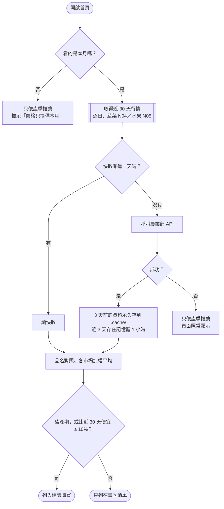

# 台灣當季蔬果

依「台灣時間的今天」顯示當季蔬菜、水果與**建議購買**品項，並附上農業部批發行情與挑選技巧。以 [Hozu](https://www.npmjs.com/package/create-hozu) 框架打造，整頁**不需要 JavaScript** 即可運作。

## 功能

| 功能 | 說明 | 網址參數 |
| ---- | ---- | -------- |
| 當季清單 | 依台灣時間（Asia/Taipei）判斷當月，列出當季蔬菜與水果 | — |
| 建議購買 | 正值盛產期，**或**批發價比近 30 天便宜 10% 以上 | — |
| 切換月份 | 查看其他月份的產季（價格只提供本月） | `?month=1`–`12` |
| 搜尋 | 搜尋全部 59 種蔬果（不限當季），可用官方品名，例如「甘藍」找到高麗菜 | `?q=草莓` |
| 篩選 | 全部／價格划算／盛產期，三個區塊同時套用 | `?show=all\|cheap\|peak` |

參數可以組合，例如 `/?month=1&show=peak&q=柑`。超出範圍的值（例如 `?month=13`）會自動退回預設。

## 快速開始

需要 **Node.js 22.18 以上**（專案附有 `.nvmrc`）。

```bash
nvm use          # 切換到 .nvmrc 指定的 Node 22
npm install
npm run dev      # 開發伺服器：http://127.0.0.1:3000
```

> 若 `localhost:3000` 開到別的程式，請改用 `127.0.0.1:3000`。

### 常用指令

| 指令 | 用途 |
| ---- | ---- |
| `npm run dev` | 開發伺服器（含 Hozu DevTools，可在頁面上選取元素提出修改） |
| `npm run check` | 型別與 Hozu 規則檢查，提交前請先跑過 |
| `npm start` | 正式模式啟動 |
| `npm run build` | 建置 |

`/demo` 保留了 `create-hozu` 產生的範本首頁，方便對照。

## 專案結構

```
features/produce/
  catalog.ts       59 種蔬果資料：產季、盛產月、產地、挑選技巧
  market-names.ts  常見名稱 ↔ 農業部官方品名對照（高麗菜 = 甘藍）
  moa-client.ts    呼叫農業部 API、磁碟／記憶體快取
  market.ts        各市場加權平均價、與近 30 天比較的漲跌
  season.ts        組合當月清單、推薦與篩選
  search.ts        全目錄搜尋、產季文字
  taipei-date.ts   台灣日期、民國年格式
  model.ts         Hozu 資料格式與 query 定義
  views.ts         頁面畫面
  icons.ts         SVG 圖示（Lucide）
app.ts             伺服器端 resolvers
app.css            色彩、字型、背景
routes.ts          網址與參數
hozu.config.ts     頁面設定
```

## 資料來源與推薦邏輯

價格來自農業部「[農產品交易行情](https://data.moa.gov.tw/)」開放資料（免金鑰），為**批發價**，零售價約為其 1.5–2 倍。



- **第一次啟動較慢**：沒有快取時需抓 30 天資料（實測約 20 秒，上限 25 秒，逾時則先不顯示價格、背景繼續抓）。之後回應約 0.02 秒，重啟也只重抓最近 3 天。
- **部署注意**：快取寫在伺服器硬碟的 `.cache/`，若部署到無持久硬碟的 serverless 平台，需改用外部儲存。

## 授權與素材

| 素材 | 授權 |
| ---- | ---- |
| 農業部農產品交易行情 | [政府資料開放授權條款](https://data.gov.tw/license) |
| Noto Sans TC／Noto Serif TC（Fontsource） | SIL Open Font License 1.1 |
| Lucide 圖示 | ISC |
| 背景圖 `assets/linen.jpg` | ⚠️ **來源授權未確認**，正式上線前請替換為有明確授權的素材 |

## 已知限制

- 產季與挑選技巧為一般年份的參考；實際價格會受天候（如颱風）影響。
- 目錄收錄 59 種台灣常見蔬果，不在目錄中的品項搜尋不到。
- 區塊副標題為白字，在米白背景上對比度約 1.1:1，未達 WCAG AA。
